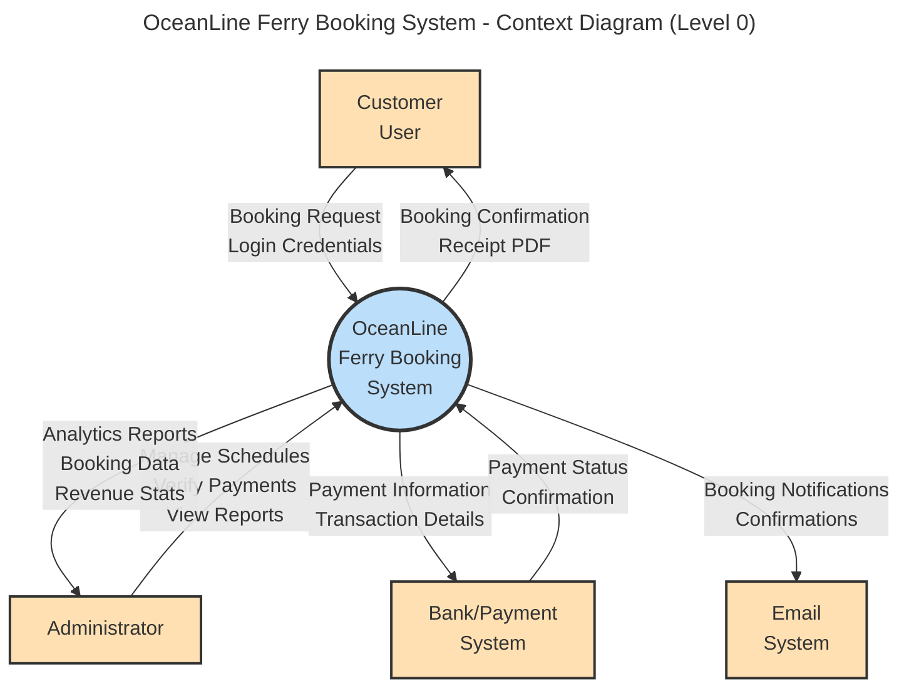
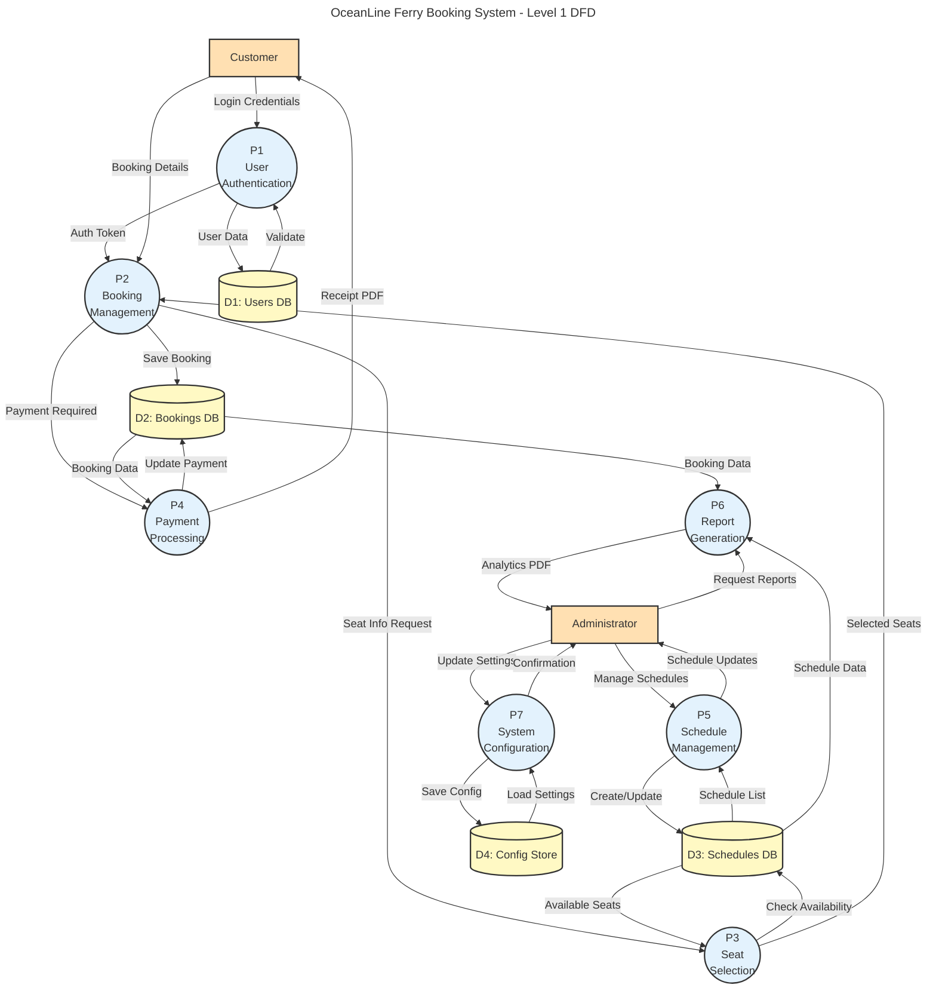
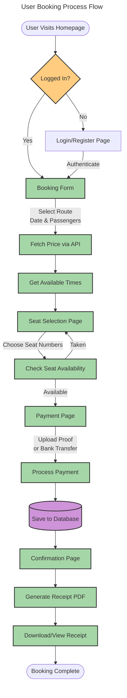
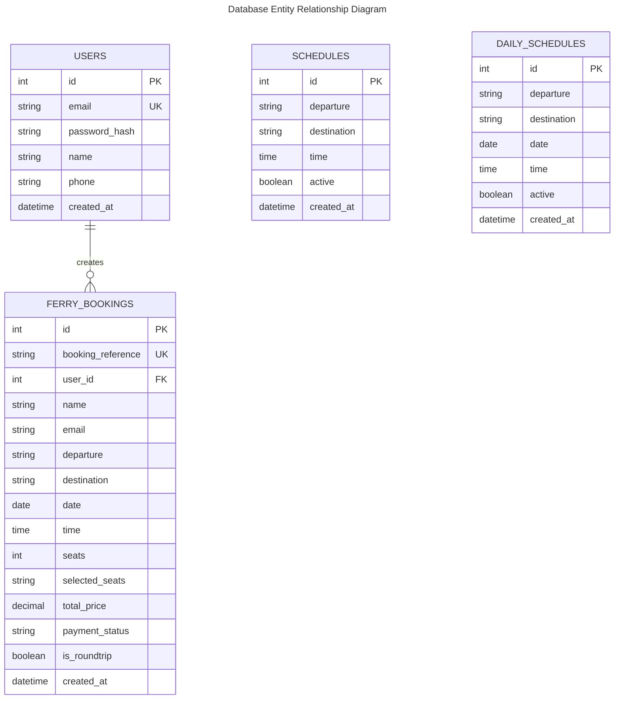
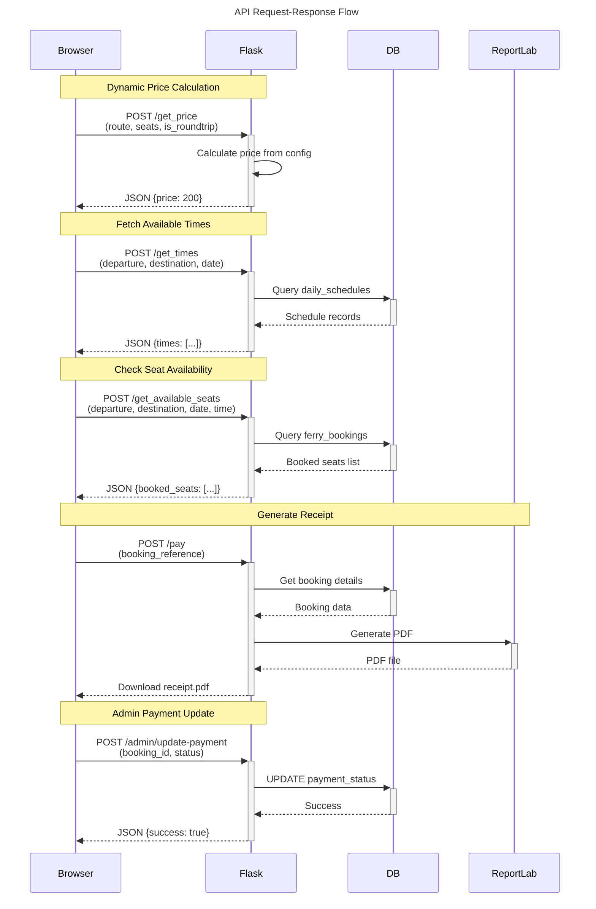
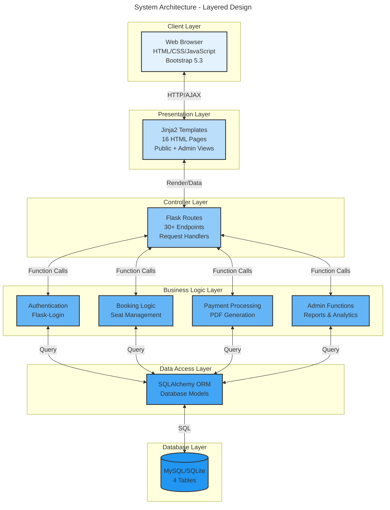

```mermaid
---
title: OceanLine Ferry Booking System - Context Diagram (Level 0)
---
graph TB
    %% External Entities
    Customer[Customer<br/>User]
    Admin[Administrator]
    Bank[Bank/Payment<br/>System]
    Email[Email<br/>System]
    
    %% Main System
    System((OceanLine<br/>Ferry Booking<br/>System))
    
    %% Data Flows - Customer
    Customer -->|Booking Request<br/>Login Credentials| System
    System -->|Booking Confirmation<br/>Receipt PDF| Customer
    
    %% Data Flows - Admin
    Admin -->|Manage Schedules<br/>Verify Payments<br/>View Reports| System
    System -->|Analytics Reports<br/>Booking Data<br/>Revenue Stats| Admin
    
    %% Data Flows - Payment
    System -->|Payment Information<br/>Transaction Details| Bank
    Bank -->|Payment Status<br/>Confirmation| System
    
    %% Data Flows - Email
    System -->|Booking Notifications<br/>Confirmations| Email
    
    %% Styling
    classDef external fill:#ffe0b2,stroke:#333,stroke-width:2px
    classDef systemNode fill:#bbdefb,stroke:#333,stroke-width:3px
    
    class Customer,Admin,Bank,Email external
    class System systemNode
```

```mermaid
---
title: OceanLine Ferry Booking System - Level 1 DFD
---
graph TB
    %% External Entities
    Customer[Customer]
    Admin[Administrator]
    
    %% Processes
    P1((P1<br/>User<br/>Authentication))
    P2((P2<br/>Booking<br/>Management))
    P3((P3<br/>Seat<br/>Selection))
    P4((P4<br/>Payment<br/>Processing))
    P5((P5<br/>Schedule<br/>Management))
    P6((P6<br/>Report<br/>Generation))
    P7((P7<br/>System<br/>Configuration))
    
    %% Data Stores
    D1[(D1: Users DB)]
    D2[(D2: Bookings DB)]
    D3[(D3: Schedules DB)]
    D4[(D4: Config Store)]
    
    %% Customer Flows
    Customer -->|Login Credentials| P1
    P1 -->|User Data| D1
    D1 -->|Validate| P1
    P1 -->|Auth Token| P2
    
    Customer -->|Booking Details| P2
    P2 -->|Save Booking| D2
    P2 -->|Seat Info Request| P3
    
    P3 -->|Check Availability| D3
    D3 -->|Available Seats| P3
    P3 -->|Selected Seats| P2
    
    P2 -->|Payment Required| P4
    P4 -->|Update Payment| D2
    D2 -->|Booking Data| P4
    P4 -->|Receipt PDF| Customer
    
    %% Admin Flows
    Admin -->|Manage Schedules| P5
    P5 -->|Create/Update| D3
    D3 -->|Schedule List| P5
    P5 -->|Schedule Updates| Admin
    
    Admin -->|Request Reports| P6
    D2 -->|Booking Data| P6
    D3 -->|Schedule Data| P6
    P6 -->|Analytics PDF| Admin
    
    Admin -->|Update Settings| P7
    P7 -->|Save Config| D4
    D4 -->|Load Settings| P7
    P7 -->|Confirmation| Admin
    
    %% Styling
    classDef external fill:#ffe0b2,stroke:#333,stroke-width:2px
    classDef process fill:#e3f2fd,stroke:#333,stroke-width:2px
    classDef datastore fill:#fff9c4,stroke:#333,stroke-width:2px
    
    class Customer,Admin external
    class P1,P2,P3,P4,P5,P6,P7 process
    class D1,D2,D3,D4 datastore
```

```mermaid
---
title: User Booking Process Flow
---
graph TD
    Start([User Visits Homepage]) --> Login{Logged In?}
    Login -->|No| RegLogin[Login/Register Page]
    Login -->|Yes| BookForm[Booking Form]
    RegLogin -->|Authenticate| BookForm
    
    BookForm -->|Select Route<br/>Date & Passengers| GetPrice[Fetch Price via API]
    GetPrice --> GetTimes[Get Available Times]
    GetTimes --> SelectSeats[Seat Selection Page]
    
    SelectSeats -->|Choose Seat Numbers| CheckAvail[Check Seat Availability]
    CheckAvail -->|Available| Payment[Payment Page]
    CheckAvail -->|Taken| SelectSeats
    
    Payment -->|Upload Proof<br/>or Bank Transfer| ProcessPay[Process Payment]
    ProcessPay --> SaveBooking[(Save to Database)]
    SaveBooking --> Confirm[Confirmation Page]
    
    Confirm --> GenPDF[Generate Receipt PDF]
    GenPDF --> Download[Download/View Receipt]
    Download --> End([Booking Complete])
    
    %% Styling
    classDef processNode fill:#a5d6a7,stroke:#333,stroke-width:2px
    classDef decisionNode fill:#ffcc80,stroke:#333,stroke-width:2px
    classDef dataNode fill:#ce93d8,stroke:#333,stroke-width:2px
    
    class BookForm,GetPrice,GetTimes,SelectSeats,CheckAvail,Payment,ProcessPay,Confirm,GenPDF,Download processNode
    class Login decisionNode
    class SaveBooking dataNode
```

```mermaid
---
title: Admin Dashboard Management Flow
---
graph TB
    AdminLogin[Admin Login] --> Dashboard{Dashboard}
    
    Dashboard --> Bookings[Manage Bookings]
    Dashboard --> Schedules[Manage Schedules]
    Dashboard --> Payments[Verify Payments]
    Dashboard --> Reports[View Reports]
    Dashboard --> Settings[System Settings]
    
    Bookings --> ViewBook[View All Bookings]
    Bookings --> UpdateStatus[Update Payment Status]
    ViewBook --> BookDB[(Bookings Database)]
    UpdateStatus --> BookDB
    
    Schedules --> AddSched[Add Schedule]
    Schedules --> EditSched[Edit Schedule]
    Schedules --> DeactiveSched[Deactivate Schedule]
    AddSched --> SchedDB[(Schedules Database)]
    EditSched --> SchedDB
    DeactiveSched --> SchedDB
    
    Payments --> CheckProof[Check Payment Proof]
    Payments --> Approve[Approve Payment]
    Payments --> Reject[Reject Payment]
    CheckProof --> BookDB
    Approve --> BookDB
    Reject --> BookDB
    
    Reports --> Revenue[Revenue Analytics]
    Reports --> BookingStats[Booking Statistics]
    Reports --> RoutePerf[Route Performance]
    Revenue --> GenReport[Generate PDF Report]
    BookingStats --> GenReport
    RoutePerf --> GenReport
    
    Settings --> Capacity[Update Ferry Capacity]
    Settings --> Pricing[Manage Route Prices]
    Settings --> Password[Change Password]
    Settings --> Export[Export Data CSV]
    Capacity --> ConfigDB[(Config Store)]
    Pricing --> ConfigDB
    
    %% Styling
    classDef adminNode fill:#ffb74d,stroke:#333,stroke-width:2px
    classDef actionNode fill:#ffa726,stroke:#333,stroke-width:2px
    classDef dbNode fill:#ce93d8,stroke:#333,stroke-width:2px
    
    class Dashboard adminNode
    class Bookings,Schedules,Payments,Reports,Settings,ViewBook,UpdateStatus,AddSched,EditSched,DeactiveSched,CheckProof,Approve,Reject,Revenue,BookingStats,RoutePerf,GenReport,Capacity,Pricing,Password,Export actionNode
    class BookDB,SchedDB,ConfigDB dbNode
```

```mermaid
---
title: Database Entity Relationship Diagram
---
erDiagram
    USERS ||--o{ FERRY_BOOKINGS : creates
    
    USERS {
        int id PK
        string email UK
        string password_hash
        string name
        string phone
        datetime created_at
    }
    
    FERRY_BOOKINGS {
        int id PK
        string booking_reference UK
        int user_id FK
        string name
        string email
        string departure
        string destination
        date date
        time time
        int seats
        string selected_seats
        decimal total_price
        string payment_status
        boolean is_roundtrip
        datetime created_at
    }
    
    SCHEDULES {
        int id PK
        string departure
        string destination
        time time
        boolean active
        datetime created_at
    }
    
    DAILY_SCHEDULES {
        int id PK
        string departure
        string destination
        date date
        time time
        boolean active
        datetime created_at
    }
```

```mermaid
---
title: API Request-Response Flow
---
sequenceDiagram
    participant Browser
    participant Flask
    participant DB
    participant ReportLab
    
    Note over Browser,Flask: Dynamic Price Calculation
    Browser->>+Flask: POST /get_price<br/>(route, seats, is_roundtrip)
    Flask->>Flask: Calculate price from config
    Flask-->>-Browser: JSON {price: 200}
    
    Note over Browser,Flask: Fetch Available Times
    Browser->>+Flask: POST /get_times<br/>(departure, destination, date)
    Flask->>+DB: Query daily_schedules
    DB-->>-Flask: Schedule records
    Flask-->>-Browser: JSON {times: [...]}
    
    Note over Browser,Flask: Check Seat Availability
    Browser->>+Flask: POST /get_available_seats<br/>(departure, destination, date, time)
    Flask->>+DB: Query ferry_bookings
    DB-->>-Flask: Booked seats list
    Flask-->>-Browser: JSON {booked_seats: [...]}
    
    Note over Browser,ReportLab: Generate Receipt
    Browser->>+Flask: POST /pay<br/>(booking_reference)
    Flask->>+DB: Get booking details
    DB-->>-Flask: Booking data
    Flask->>+ReportLab: Generate PDF
    ReportLab-->>-Flask: PDF file
    Flask-->>-Browser: Download receipt.pdf
    
    Note over Browser,Flask: Admin Payment Update
    Browser->>+Flask: POST /admin/update-payment<br/>(booking_id, status)
    Flask->>+DB: UPDATE payment_status
    DB-->>-Flask: Success
    Flask-->>-Browser: JSON {success: true}
```

```mermaid
---
title: System Architecture - Layered Design
---
graph TD
    subgraph Client["Client Layer"]
        Browser[Web Browser<br/>HTML/CSS/JavaScript<br/>Bootstrap 5.3]
    end
    
    subgraph Presentation["Presentation Layer"]
        Templates[Jinja2 Templates<br/>16 HTML Pages<br/>Public + Admin Views]
    end
    
    subgraph Controller["Controller Layer"]
        Routes[Flask Routes<br/>30+ Endpoints<br/>Request Handlers]
    end
    
    subgraph Business["Business Logic Layer"]
        Auth[Authentication<br/>Flask-Login]
        BookLogic[Booking Logic<br/>Seat Management]
        PayLogic[Payment Processing<br/>PDF Generation]
        AdminLogic[Admin Functions<br/>Reports & Analytics]
    end
    
    subgraph Data["Data Access Layer"]
        ORM[SQLAlchemy ORM<br/>Database Models]
    end
    
    subgraph Database["Database Layer"]
        MySQL[(MySQL/SQLite<br/>4 Tables)]
    end
    
    Browser <-->|HTTP/AJAX| Templates
    Templates <-->|Render/Data| Routes
    Routes <-->|Function Calls| Auth
    Routes <-->|Function Calls| BookLogic
    Routes <-->|Function Calls| PayLogic
    Routes <-->|Function Calls| AdminLogic
    
    Auth <-->|Query| ORM
    BookLogic <-->|Query| ORM
    PayLogic <-->|Query| ORM
    AdminLogic <-->|Query| ORM
    
    ORM <-->|SQL| MySQL
    
    %% Styling
    classDef clientStyle fill:#e3f2fd,stroke:#333,stroke-width:2px
    classDef presStyle fill:#bbdefb,stroke:#333,stroke-width:2px
    classDef ctrlStyle fill:#90caf9,stroke:#333,stroke-width:2px
    classDef bizStyle fill:#64b5f6,stroke:#333,stroke-width:2px
    classDef dataStyle fill:#42a5f5,stroke:#333,stroke-width:2px
    classDef dbStyle fill:#2196f3,stroke:#333,stroke-width:2px
    
    class Browser clientStyle
    class Templates presStyle
    class Routes ctrlStyle
    class Auth,BookLogic,PayLogic,AdminLogic bizStyle
    class ORM dataStyle
    class MySQL dbStyle
```
